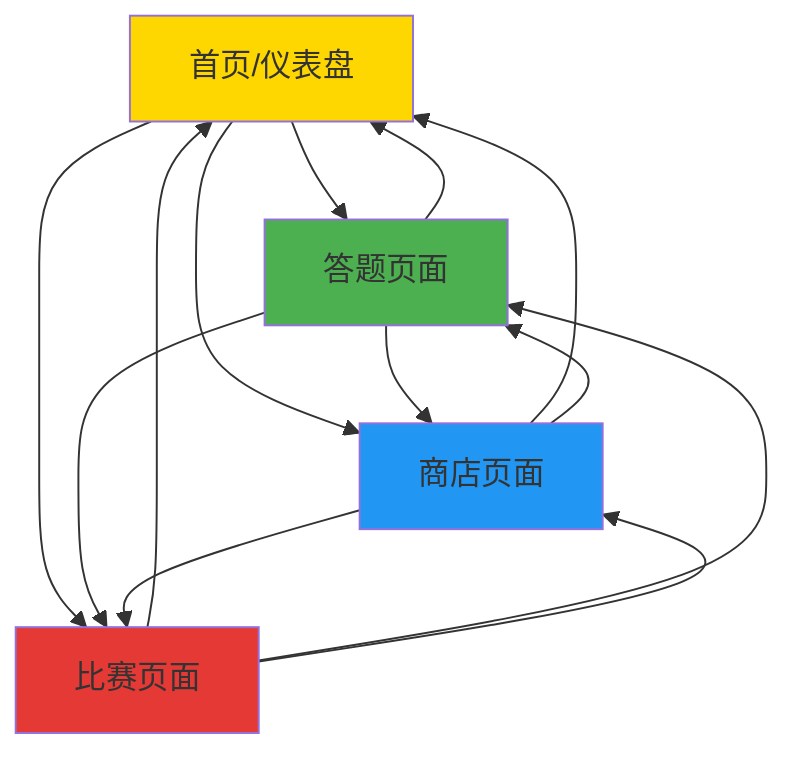

# Word Racing UX Redesign PRD

> **文档版本**: v1.0  
> **设计者**: Qi (Team Lead)  
> **目标用户**: 6年级学生  
> **设计日期**: 2026-05-11  
> **任务类型**: UX重构 - 从Overlay模式到多页面自由切换

---

## 一、项目背景

### 1.1 当前问题

现有Word Racing游戏使用**Overlay方式**在赛道Canvas上叠加答题和商店界面，导致：

1. **布局问题**：页面元素容易超出overlay边界
2. **空间限制**：布局拥挤，没有足够空间展示内容
3. **体验问题**：用户体验不流畅，交互受限
4. **扩展性差**：难以添加新功能（成就系统、详细统计等）

### 1.2 重构目标

改造成**多页面自由切换模式**，类似仪表盘设计：

- ✅ 每个功能模块有独立页面
- ✅ 用户可以自由切换模式（非线性的）
- ✅ 提供足够的信息展示空间
- ✅ 增强用户体验和参与度

---

## 二、新页面架构设计

### 2.1 页面结构概览

```
Word Racing 多页面架构
│
├── 1. 首页/仪表盘 (Dashboard)
│   ├── 1.1 用户数据区
│   ├── 1.2 赛车展示区
│   ├── 1.3 成就系统区
│   └── 1.4 快速操作区
│
├── 2. 答题页面 (Quiz)
│   ├── 2.1 题目展示区
│   ├── 2.2 答题交互区
│   ├── 2.3 进度显示区
│   └── 2.4 结果统计区
│
├── 3. 商店页面 (Shop)
│   ├── 3.1 商品分类标签
│   ├── 3.2 商品列表区
│   ├── 3.3 购物车/确认区
│   └── 3.4 车辆预览区
│
└── 4. 比赛页面 (Racing)
    ├── 4.1 Canvas赛道区
    ├── 4.2 HUD信息区
    ├── 4.3 控制区
    └── 4.4 迷你地图区
```

### 2.2 页面导航设计

**核心原则**：**自由切换** - 用户可以在任何时候切换到任意模式

```
┌─────────────────────────────────────────┐
│  顶部导航栏 (常驻)                      │
│  [首页] [答题] [商店] [比赛] [设置]    │
└─────────────────────────────────────────┘
```

**导航逻辑**：
- 顶部导航栏在所有页面都可见
- 当前页面高亮显示
- 点击任意标签 → 切换到对应页面
- 每个页面都有返回按钮（回到首页）

---

## 三、页面详细设计

### 3.1 首页/仪表盘 (Dashboard)

#### 3.1.1 布局设计 (Wireframe)

```
┌──────────────────────────────────────────────────────────┐
│  Word Racing        [金币: 1250🪙] [装备币: 30⚙️] [?] │
├──────────────────────────────────────────────────────────┤
│                                                         │
│  ┌──────────────┐  ┌──────────────┐  ┌────────────┐ │
│  │              │  │  跑圈记录     │  │  成就系统  │ │
│  │   赛车展示   │  │  🏆 最佳:    │  │  🎖️ 已解锁 │ │
│  │   (3D/2D)   │  │  1:23.45     │  │     12/50  │ │
│  │              │  │  📊 总圈数:   │  │             │ │
│  │  [自定义]    │  │     156       │  │  [查看全部] │ │
│  └──────────────┘  └──────────────┘  └────────────┘ │
│                                                         │
│  ┌────────────────────────────────────────────────────┐ │
│  │  快速操作区                                        │ │
│  │  [开始答题]  [前往商店]  [开始比赛]  [排行榜]     │ │
│  └────────────────────────────────────────────────────┘ │
│                                                         │
│  ┌──────────────┐  ┌──────────────┐  ┌────────────┐ │
│  │  今日统计     │  │  本周统计     │  │  装备栏    │ │
│  │  📝 答题: 15 │  │  📝 答题: 85 │  │  [头盔]   │ │
│  │  🏁 比赛: 3  │  │  🏁 比赛: 18 │  │  [轮胎]   │ │
│  │  💰 金币: 350│  │  💰 金币:1800│  │  [引擎]   │ │
│  └──────────────┘  └──────────────┘  └────────────┘ │
└──────────────────────────────────────────────────────────┘
```

#### 3.1.2 功能模块

**A. 用户数据区**
- **金币数据**：
  - 燃油币🪙：用于购买燃油、装备
  - 装备币⚙️：用于升级赛车（可选，也可统一用金币）
  - 显示位置：顶部导航栏右侧

**B. 赛车展示区**
- **3D/2D赛车模型**：可旋转查看
- **当前配置**：显示已装备的零件
- **自定义按钮**：进入赛车自定义界面

**C. 跑圈记录区**
- **历史最佳成绩**：最快圈速、总圈数
- **最近成绩**：最近5次比赛成绩
- **排行榜入口**：查看全球/班级排名

**D. 成就系统区**
- **成就进度**：已解锁成就数/总成就数
- **最近成就**：最新解锁的成就
- **成就列表入口**：查看所有成就

**E. 快速操作区**
- **开始答题**：进入答题页面
- **前往商店**：进入商店页面
- **开始比赛**：进入比赛页面（检查燃油>0）
- **排行榜**：查看排行榜

**F. 统计数据区**
- **今日统计**：答题数、比赛数、获得金币
- **本周统计**：汇总数据
- **装备栏**：当前装备的道具

#### 3.1.3 交互设计

- **点击赛车**：查看赛车详情/自定义
- **点击成就**：查看成就详情
- **点击记录**：查看详细历史记录
- **导航栏**：切换到其他页面

---

### 3.2 答题页面 (Quiz)

#### 3.2.1 布局设计 (Wireframe)

```
┌──────────────────────────────────────────────────────────┐
│  [首页] 📝答题 [商店] [比赛] [设置]                    │
├──────────────────────────────────────────────────────────┤
│                                                         │
│  ┌────────────────────────────────────────────────────┐ │
│  │  进度条: ████████████████░░░░  8/15             │ │
│  │  正确数: 6  |  正确率: 75%  |  用时: 02:35     │ │
│  └────────────────────────────────────────────────────┘ │
│                                                         │
│  ┌────────────────────────────────────────────────────┐ │
│  │                                                    │ │
│  │              ╔════════════════╗                    │ │
│  │              ║   Word Racing  ║                    │ │
│  │              ║   英文单词     ║                    │ │
│  │              ╚════════════════╝                    │ │
│  │                                                    │ │
│  │              "speed"                               │ │
│  │                                                    │ │
│  │     ┌──────────┐    ┌──────────┐                 │ │
│  │     │  A. 速度 │    │  B. 刹车 │                 │ │
│  │     └──────────┘    └──────────┘                 │ │
│  │                                                    │ │
│  │     ┌──────────┐    ┌──────────┐                 │ │
│  │     │ C. 引擎  │    │  D. 冠军 │                 │ │
│  │     └──────────┘    └──────────┘                 │ │
│  │                                                    │ │
│  └────────────────────────────────────────────────────┘ │
│                                                         │
│  ┌────────────────────────────────────────────────────┐ │
│  │  题目类型: [简单题] [复杂题]                      │ │
│  │  套数选择: [1套(5题)] [2套(10题)] [3套(15题)]   │ │
│  └────────────────────────────────────────────────────┘ │
│                                                         │
│  [返回首页]  [重新开始]  [查看错题]                    │
└──────────────────────────────────────────────────────────┘
```

#### 3.2.2 功能模块

**A. 题目展示区**
- **英文单词**：大字体显示，醒目
- **例句**（复杂题）：显示单词在句子中的用法
- **音标**（可选）：显示音标，帮助发音

**B. 答题交互区**
- **4个选项按钮**：A/B/C/D，点击选择
- **反馈动画**：正确（绿色闪烁）、错误（红色闪烁）
- **下一题按钮**：答题后自动跳转（延迟0.8秒）

**C. 进度显示区**
- **进度条**：当前题号/总题数
- **正确数**：实时更新
- **正确率**：实时计算
- **用时**：计时器

**D. 题目类型选择**
- **简单题**：只显示单词和释义
- **复杂题**：显示单词、释义、例句、音标

**E. 套数选择**
- **1套（5题）**：快速答题
- **2套（10题）**：中等挑战
- **3套（15题）**：全力挑战（奖励倍数1.5x）

**F. 结果统计区**（答题结束后显示）
- **得分**：总得分、正确数、正确率
- **奖励**：获得的金币、Nitro充能
- **错题回顾**：显示错题列表
- **再玩一次**：重新开始答题

#### 3.2.3 交互设计

- **选择答案**：点击选项按钮
- **查看释义**：点击单词查看详细释义（可选）
- **跳过题目**：可选，不惩罚但也不奖励
- **中途退出**：保存进度，返回首页

---

### 3.3 商店页面 (Shop)

#### 3.3.1 布局设计 (Wireframe)

```
┌──────────────────────────────────────────────────────────┐
│  [首页] [答题] 🛒商店 [比赛] [设置]  金币: 1250🪙    │
├──────────────────────────────────────────────────────────┤
│                                                         │
│  ┌─────────────┐  ┌──────────────────────────────────┐│
│  │  商品分类   │  │  商品列表                        ││
│  │             │  │                                  ││
│  │ [🔥燃油]   │  │  ┌────────────────────────────┐ ││
│  │ [⚡Nitro]  │  │  │ 燃油 +20                    │ ││
│  │ [🔧改装]   │  │  │ 补充20单位燃油               │ ││
│  │ [🎨外观]   │  │  │ 价格: 15🪙  [购买]         │ ││
│  │             │  │  └────────────────────────────┘ ││
│  │             │  │                                  ││
│  │             │  │  ┌────────────────────────────┐ ││
│  │             │  │  │ Nitro x3                  │ ││
│  │             │  │  │ 3次氮气加速                │ ││
│  │             │  │  │ 价格: 50🪙  [购买]        │ ││
│  │             │  │  └────────────────────────────┘ ││
│  │             │  │                                  ││
│  └─────────────┘  └──────────────────────────────────┘│
│                                                         │
│  ┌────────────────────────────────────────────────────┐ │
│  │  车辆预览                                        │ │
│  │  ┌─────────┐                                    │ │
│  │  │         │  当前配置:                         │ │
│  │  │ 赛车3D │  - 引擎: T2 高效引擎               │ │
│  │  │  视图   │  - 轮胎: T1 标准轮胎               │ │
│  │  │         │  - 车身: T1 标准车身               │ │
│  │  └─────────┘                                    │ │
│  └────────────────────────────────────────────────────┘ │
└──────────────────────────────────────────────────────────┘
```

#### 3.3.2 功能模块

**A. 商品分类标签**
- **🔥燃油类**：购买燃油补充
- **⚡装备类**：购买Nitro充能
- **🔧改装类**：升级赛车性能
- **🎨外观类**：自定义赛车外观（涂装、贴纸等）

**B. 商品列表区**
- **商品卡片**：显示商品名称、描述、价格
- **购买按钮**：点击购买，弹出确认对话框
- **库存显示**：显示当前拥有数量（如Nitro x5）

**C. 购物车/确认区**
- **确认对话框**：显示商品信息、价格，确认购买
- **余额检查**：检查金币是否足够
- **购买成功提示**：显示购买结果

**D. 车辆预览区**
- **3D/2D赛车模型**：实时显示当前配置
- **当前配置**：显示已装备的零件
- **效果对比**：改装前后的性能对比

**E. 商品详情**

**燃油类**：
| 商品 | 效果 | 价格 | 限制 |
|------|------|------|------|
| 燃油+20 | 补充20单位 | 15🪙 | ≤100 |
| 燃油+50 | 补充50单位 | 30🪙 | ≤100 |
| 加满燃油 | 补充到100 | 50🪙 | - |

**装备类（Nitro）**：
| 商品 | 效果 | 价格 | 使用次数 |
|------|------|------|----------|
| Nitro x1 | 1次加速 | 20🪙 | 1次 |
| Nitro x3 | 3次加速 | 50🪙 | 3次 |
| Nitro x10 | 10次加速 | 150🪙 | 10次 |

**改装类**：
| 零件 | 等级 | 效果 | 价格 | 前置 |
|------|------|------|------|------|
| 引擎 | T2 | 燃油消耗-10% | 100🪙 | - |
| 引擎 | T3 | 燃油消耗-20%, 加速+10% | 300🪙 | T2 |
| 引擎 | T4 | 燃油消耗-30%, 加速+20% | 800🪙 | T3 |
| 轮胎 | T2 | 转弯性能+15% | 120🪙 | - |
| 轮胎 | T3 | 转弯+30%, off-track摩擦-50% | 350🪙 | T2 |
| 轮胎 | T4 | 转弯+50%, 全地形适应 | 900🪙 | T3 |
| 车身 | T2 | 最高速度+5% | 150🪙 | - |
| 车身 | T3 | 速度+10%, Nitro效果+20% | 400🪙 | T2 |
| 车身 | T4 | 速度+15%, Nitro效果+50% | 1000🪙 | T3 |

#### 3.3.3 交互设计

- **选择分类**：点击左侧标签，切换商品列表
- **购买商品**：点击购买按钮 → 弹出确认对话框 → 确认购买
- **查看详情**：点击商品卡片，查看详细信息
- **返回首页**：点击"返回首页"按钮

---

### 3.4 比赛页面 (Racing)

#### 3.4.1 布局设计 (Wireframe)

```
┌──────────────────────────────────────────────────────────┐
│  [首页] [答题] [商店] 🏁比赛 [设置]                    │
├──────────────────────────────────────────────────────────┤
│                                                         │
│  ┌──────┐                                             │
│  │圈数  │  ┌──────────────────────────────────────┐   │
│  │ 2/5  │  │                                      │   │
│  └──────┘  │                                      │   │
│             │         Canvas 赛道区域                │   │
│  ┌──────┐  │                                      │   │
│  │时间  │  │         (赛车、赛道、特效)             │   │
│  │1:23  │  │                                      │   │
│  └──────┘  │                                      │   │
│             └──────────────────────────────────────┘   │
│                                                         │
│  ┌──────────┐  ┌──────────┐  ┌──────────┐           │
│  │  车速表   │  │  Nitro   │  │  金币    │           │
│  │   120    │  │  [■■■□□] │  │  1250🪙  │           │
│  │   km/h   │  │   3/5    │  │          │           │
│  └──────────┘  └──────────┘  └──────────┘           │
│                                                         │
│  ┌────────────────────────────────────────────────────┐ │
│  │  迷你地图  [赛道缩略图]  赛车位置标记              │ │
│  └────────────────────────────────────────────────────┘ │
│                                                         │
│  [返回首页]  [重新开始]  [设置]  [退出比赛]            │
└──────────────────────────────────────────────────────────┘
```

#### 3.4.2 功能模块

**A. Canvas赛道区**
- **赛道渲染**：使用现有track.js渲染赛道
- **赛车渲染**：使用现有car.js渲染赛车
- **特效**：Nitro火焰、漂移痕迹等

**B. HUD信息区**
- **圈数显示**：当前圈/总圈数
- **计时器**：比赛用时
- **车速表**：当前速度（km/h）
- **Nitro显示**：剩余充能数、使用状态
- **金币显示**：当前金币数量
- **燃油进度条**：剩余燃油量

**C. 控制区**
- **键盘控制**：方向键/WASD + 空格（Nitro）
- **触控控制**（移动端）：虚拟按钮
- **暂停按钮**：暂停比赛

**D. 迷你地图区**
- **赛道缩略图**：显示完整赛道
- **赛车位置**：实时标记
- **检查点**：显示检查点位置（可选）

**E. 比赛结束界面**
- **成绩展示**：总时间、最快圈速、排名
- **奖励结算**：获得金币、经验值
- **错题回顾**：如果刚答完题，显示错题
- **操作按钮**：[再玩一次] [返回首页] [查看成绩]

#### 3.4.3 交互设计

- **开始比赛**：选择圈数（1-5圈），点击开始
- **暂停比赛**：按ESC或点击暂停按钮
- **使用Nitro**：按空格键（需要有充能）
- **退出比赛**：点击"退出比赛"按钮，确认后返回首页
- **比赛结束**：自动显示成绩界面

---

## 四、页面间导航流程

### 4.1 导航流程图



### 4.2 导航规则

**自由切换原则**：
- ✅ 用户可以随时切换到任意页面
- ✅ 不会丢失当前进度（答题进度、比赛进度等）
- ✅ 返回时恢复原状态

**特殊场景处理**：
1. **答题中切换到商店**：保存当前题目进度，返回后继续
2. **比赛中切换到答题**：暂停比赛，返回后继续
3. **商店中切换到比赛**：检查燃油>0，允许切换

**数据同步**：
- 金币、燃油、Nitro等数据在页面间实时同步
- 使用localStorage或全局状态管理

---

## 五、数据流转逻辑

### 5.1 数据结构设计

**全局游戏状态**：
```javascript
const gameState = {
    // 用户资源
    coins: 1250,
    fuel: 75,
    nitro: 5,
    
    // 赛车配置
    car: {
        engineLevel: 2,  // 1-4
        tireLevel: 1,    // 1-4
        bodyLevel: 1,    // 1-4
        color: '#E53935',
        decals: []
    },
    
    // 答题进度
    quiz: {
        currentIndex: 0,
        totalQuestions: 15,
        correctCount: 0,
        isActive: false
    },
    
    // 比赛状态
    racing: {
        isActive: false,
        currentLap: 0,
        totalLaps: 5,
        bestLapTime: 83245,  // ms
        totalRaceTime: 0
    },
    
    // 成就系统
    achievements: {
        unlocked: [1, 2, 3, 4, 5],
        total: 50
    },
    
    // 统计 data
    stats: {
        totalQuizzes: 85,
        totalRaces: 18,
        totalCoinsEarned: 18000,
        bestLapTime: 83245
    }
};
```

### 5.2 数据流转图

```
┌─────────────┐
│  首页/仪表盘 │
│  - 读取数据  │
│  - 展示统计  │
└──────┬──────┘
       │
       ├──→ ┌─────────────┐
       │    │  答题页面     │
       │    │  - 修改coins  │
       │    │  - 修改nitro │
       │    └──────┬──────┘
       │           │
       │           └──→ 更新gameState
       │
       ├──→ ┌─────────────┐
       │    │  商店页面     │
       │    │  - 修改coins │
       │    │  - 修改fuel  │
       │    │  - 修改car   │
       │    └──────┬──────┘
       │           │
       │           └──→ 更新gameState
       │
       └──→ ┌─────────────┐
            │  比赛页面     │
            │  - 修改fuel  │
            │  - 修改nitro │
            │  - 更新stats │
            └──────┬──────┘
                   │
                   └──→ 更新gameState
```

### 5.3 数据持久化

**使用localStorage存储**：
```javascript
// 保存游戏状态
function saveGameState() {
    localStorage.setItem('wordRacing_save', JSON.stringify(gameState));
}

// 加载游戏状态
function loadGameState() {
    const saved = localStorage.getItem('wordRacing_save');
    if (saved) {
        return JSON.parse(saved);
    }
    return getDefaultState();
}
```

**自动保存触发点**：
- 答题完成后
- 购买商品后
- 比赛结束后
- 页面关闭前（beforeunload事件）

---

## 六、技术实现方案

### 6.1 技术栈

**前端技术**：
- **HTML5**：页面结构
- **CSS3**：样式和布局（Flexbox/Grid）
- **JavaScript（ES6+）**：交互逻辑
- **Canvas API**：赛道渲染（比赛页面）

**可选框架**：
- **原生JS**：轻量，适合小项目
- **Vue.js/React**：组件化，易于维护（推荐）

**数据存储**：
- **localStorage**：本地存储
- **IndexedDB**：存储大量数据（如排行榜）

### 6.2 文件结构

```
word-racing/
├── index.html              # 主入口（单页应用）
├── pages/
│   ├── dashboard.html      # 首页/仪表盘
│   ├── quiz.html          # 答题页面
│   ├── shop.html          # 商店页面
│   └── racing.html       # 比赛页面
├── css/
│   ├── common.css        # 通用样式
│   ├── dashboard.css     # 首页样式
│   ├── quiz.css          # 答题页面样式
│   ├── shop.css          # 商店页面样式
│   └── racing.css       # 比赛页面样式
├── js/
│   ├── common/
│   │   ├── navigation.js # 页面导航管理
│   │   ├── state.js      # 全局状态管理
│   │   └── storage.js    # 数据持久化
│   ├── dashboard/
│   │   └── dashboard.js  # 首页逻辑
│   ├── quiz/
│   │   ├── quiz.js       # 答题逻辑（已有）
│   │   └── quizUI.js     # 答题UI管理
│   ├── shop/
│   │   └── shop.js       # 商店逻辑
│   ├── racing/
│   │   ├── game.js       # 游戏主控制器（已有）
│   │   ├── car.js        # 赛车物理（已有）
│   │   ├── track.js      # 赛道定义（已有）
│   │   └── racingUI.js   # 比赛UI管理
│   └── components/
│       ├── header.js      # 顶部导航栏组件
│       ├── carPreview.js # 赛车预览组件
│       └── notifications.js # 通知组件
├── data/
│   ├── words.json        # 词汇库
│   └── achievements.json  # 成就定义
└── assets/
    ├── images/           # 图片资源
    ├── sounds/           # 音效
    └── fonts/            # 字体
```

### 6.3 核心实现思路

#### 6.3.1 单页应用（SPA）方案

**方案A：多HTML文件**（简单，推荐）
- 每个页面一个HTML文件
- 使用`<iframe>`或动态加载内容
- 优点：简单直观，易于调试
- 缺点：页面切换有刷新感

**方案B：单页应用（推荐）**
- 一个HTML文件，多个页面视图
- 使用JavaScript动态切换视图
- 优点：无刷新，体验流畅
- 缺点：需要更多JS代码

**推荐实现（方案B）**：

```html
<!-- index.html -->
<!DOCTYPE html>
<html>
<head>
    <link rel="stylesheet" href="css/common.css">
    <link rel="stylesheet" href="css/dashboard.css">
    <link rel="stylesheet" href="css/quiz.css">
    <link rel="stylesheet" href="css/shop.css">
    <link rel="stylesheet" href="css/racing.css">
</head>
<body>
    <!-- 顶部导航栏 -->
    <header id="header"></header>
    
    <!-- 页面容器 -->
    <main id="pageContainer">
        <div id="dashboardPage" class="page active"></div>
        <div id="quizPage" class="page"></div>
        <div id="shopPage" class="page"></div>
        <div id="racingPage" class="page"></div>
    </main>
    
    <!-- 通知容器 -->
    <div id="notifications"></div>
    
    <script src="js/common/navigation.js"></script>
    <script src="js/common/state.js"></script>
    <script src="js/common/storage.js"></script>
    <script src="js/components/header.js"></script>
    <script src="js/dashboard/dashboard.js"></script>
    <script src="js/quiz/quizUI.js"></script>
    <script src="js/shop/shop.js"></script>
    <script src="js/racing/racingUI.js"></script>
    <script src="app.js"></script>
</body>
</html>
```

```javascript
// js/common/navigation.js
class NavigationManager {
    constructor() {
        this.currentPage = 'dashboard';
        this.pages = ['dashboard', 'quiz', 'shop', 'racing'];
    }
    
    // 切换到指定页面
    navigateTo(pageName) {
        // 保存当前页面状态
        this.saveCurrentPageState();
        
        // 隐藏所有页面
        this.pages.forEach(page => {
            document.getElementById(`${page}Page`).classList.remove('active');
        });
        
        // 显示目标页面
        document.getElementById(`${pageName}Page`).classList.add('active');
        
        // 更新当前页面
        this.currentPage = pageName;
        
        // 更新导航栏高亮
        this.updateNavHighlight(pageName);
        
        // 加载页面数据
        this.loadPageData(pageName);
    }
    
    // 保存当前页面状态
    saveCurrentPageState() {
        // 根据currentPage保存到gameState
    }
    
    // 加载页面数据
    loadPageData(pageName) {
        // 根据pageName从gameState加载
    }
    
    // 更新导航栏高亮
    updateNavHighlight(pageName) {
        // 更新导航栏按钮状态
    }
}
```

#### 6.3.2 全局状态管理

```javascript
// js/common/state.js
class GameStateManager {
    constructor() {
        this.state = this.loadState();
        this.listeners = [];
    }
    
    // 加载状态
    loadState() {
        const saved = localStorage.getItem('wordRacing_save');
        if (saved) {
            return JSON.parse(saved);
        }
        return this.getDefaultState();
    }
    
    // 获取默认状态
    getDefaultState() {
        return {
            coins: 0,
            fuel: 100,
            nitro: 0,
            car: {
                engineLevel: 1,
                tireLevel: 1,
                bodyLevel: 1,
                color: '#E53935'
            },
            stats: {
                totalQuizzes: 0,
                totalRaces: 0,
                bestLapTime: Infinity
            }
        };
    }
    
    // 更新状态
    updateState(updates) {
        Object.assign(this.state, updates);
        this.saveState();
        this.notifyListeners();
    }
    
    // 保存状态
    saveState() {
        localStorage.setItem('wordRacing_save', JSON.stringify(this.state));
    }
    
    // 添加监听器
    addListener(callback) {
        this.listeners.push(callback);
    }
    
    // 通知监听器
    notifyListeners() {
        this.listeners.forEach(callback => callback(this.state));
    }
}
```

#### 6.3.3 页面通信

**使用自定义事件**：
```javascript
// 页面A发送事件
document.dispatchEvent(new CustomEvent('coinsUpdated', { detail: { coins: 1250 } }));

// 页面B监听事件
document.addEventListener('coinsUpdated', (e) => {
    console.log('Coins updated:', e.detail.coins);
    updateCoinsDisplay(e.detail.coins);
});
```

### 6.4 响应式设计

**适配不同屏幕**：
- **桌面端**：>1024px，完整布局
- **平板端**：768px-1024px，调整布局
- **手机端**：<768px，垂直布局

**CSS Media Queries**：
```css
/* 桌面端 */
@media (min-width: 1024px) {
    .dashboard {
        grid-template-columns: 1fr 1fr 1fr;
    }
}

/* 平板端 */
@media (min-width: 768px) and (max-width: 1023px) {
    .dashboard {
        grid-template-columns: 1fr 1fr;
    }
}

/* 手机端 */
@media (max-width: 767px) {
    .dashboard {
        grid-template-columns: 1fr;
    }
    
    header nav {
        flex-direction: column;
    }
}
```

### 6.5 性能优化

**优化策略**：
1. **懒加载**：只在需要时加载页面资源
2. **缓存**：缓存词汇库、成就数据等
3. **防抖/节流**：限制高频事件触发
4. **虚拟滚动**：长列表使用虚拟滚动
5. **图片优化**：压缩图片，使用WebP格式

**示例：懒加载页面**：
```javascript
// 懒加载答题页面
function loadQuizPage() {
    if (!window.quizPageLoaded) {
        import('./js/quiz/quizUI.js').then(module => {
            window.quizUI = new module.QuizUI();
            window.quizPageLoaded = true;
        });
    }
}
```

---

## 七、实施计划

### 7.1 开发阶段

**Phase 1：基础架构（1-2天）**
- 创建HTML/CSS框架
- 实现页面导航系统
- 实现全局状态管理

**Phase 2：首页开发（1天）**
- 实现仪表盘布局
- 实现数据统计展示
- 实现赛车预览

**Phase 3：答题页面开发（1-2天）**
- 从现有overlay提取答题UI
- 实现独立答题页面
- 适配新布局

**Phase 4：商店页面开发（1-2天）**
- 从现有overlay提取商店UI
- 实现独立商店页面
- 添加改装系统UI

**Phase 5：比赛页面开发（1天）**
- 从现有Canvas提取比赛UI
- 实现独立比赛页面
- 优化HUD显示

**Phase 6：测试与优化（1-2天）**
- 功能测试
- 性能优化
- 响应式测试

### 7.2 风险与应对

**风险1：现有代码耦合度高**
- 应对：逐步重构，保持旧代码可用

**风险2：页面切换性能问题**
- 应对：使用SPA方案，减少页面加载时间

**风险3：数据同步问题**
- 应对：使用全局状态管理，统一数据源

---

## 八、总结

### 8.1 设计亮点

1. **多页面自由切换**：用户可以在任何时候切换到任意模式
2. **信息展示充分**：每个页面有充足空间展示内容
3. **用户体验流畅**：SPA方案，无刷新切换
4. **扩展性强**：易于添加新功能（成就、排行榜等）
5. **响应式设计**：适配不同设备

### 8.2 下一步行动

1. **确认设计方案**：与团队讨论，确认设计细节
2. **开始Phase 1开发**：搭建基础架构
3. **并行开发**：各页面可以并行开发
4. **用户测试**：邀请6年级学生试玩，收集反馈

---

**PRD文档结束**

> 本文档详细描述了Word Racing游戏从Overlay模式到多页面自由切换模式的UX重构方案，包含页面架构、布局设计、数据流转、技术实现等内容，可直接用于开发指导。
