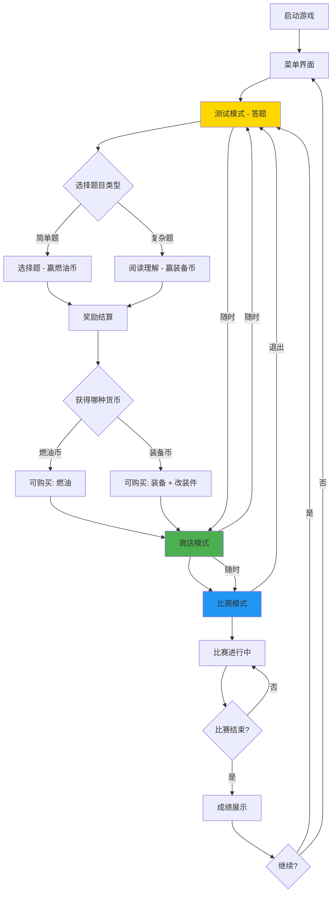

# Word Racing 游戏机制设计文档

> **文档版本**: v1.0  
> **设计者**: Xu (Product Manager)  
> **目标用户**: 6年级学生  
> **设计日期**: 2026-05-11

---

## 一、游戏流程图



### 流程说明

1. **游戏启动** → 必须进入**测试模式**（答题模式）
2. **测试模式** → 选择题目类型（简单题/复杂题）
3. **双货币系统**：
   - **燃油币**（Fuel Coins）→ 只能购买燃油
   - **装备币**（Gear Coins）→ 可以购买装备和改装件
4. **商店模式** ←→ **测试模式** ←→ **比赛模式**（自由切换）
5. **比赛模式** → 消耗燃油，使用装备，完成比赛
6. **成绩展示** → 返回测试模式（必须重新答题）

---

## 二、三模式系统详细设计

### 2.1 测试模式（QUIZ Mode）

**核心功能**：答题赚取**燃油币**和**装备币**

**界面布局**：
- **顶部**：进度条（当前题号/总题数）+ 正确题数 + **题目类型选择**
- **中部**：题目显示区域
  - **简单题**：英文单词 + 4个中文选项（A/B/C/D）
  - **复杂题**：英文短文 + 阅读理解问题 + 输入框/选择题
- **底部**：燃油币显示、装备币显示、Nitro 显示

**题目类型选择**：
- **简单题（选择题）**：
  - 奖励：**燃油币**
  - 用途：只能用来购买燃油
  - 每题奖励：10-20 燃油币（根据难度）
  
- **复杂题（阅读理解/填空）**：
  - 奖励：**装备币**
  - 用途：用来购买装备和改装件
  - 每题奖励：30-50 装备币（根据难度）

**题目套数机制**：
- **基础套数**：5题/套
- **可选套数**：1套（5题）、2套（10题）、3套（15题）
- **套数选择**：答题前选择，影响总奖励倍数

**题目难度梯度**：
| 等级 | 词汇难度 | 适合年级 | 燃油币倍率 | 装备币倍率 |
|------|----------|----------|-------------|-------------|
| 1    | 基础词汇 | 4-5年级  | 1.0x        | 1.0x        |
| 2    | 进阶词汇 | 6年级    | 1.5x        | 1.5x        |
| 3    | 挑战词汇 | 7-8年级  | 2.0x        | 2.0x        |

**答题奖励规则**：

**简单题（选择题）**：
- **正确**：+10燃油币 × 难度倍率
- **错误**：不扣除燃油币，但记录错题
- **连击奖励**：连续正确3题，额外+5燃油币；5题，额外+10燃油币

**复杂题（阅读理解/填空）**：
- **正确**：+30装备币 × 难度倍率
- **错误**：不扣除装备币，但记录错题
- **连击奖励**：连续正确3题，额外+20装备币；5题，额外+50装备币

**Nitro 奖励**：
- 每正确1题（无论简单/复杂）→ +1 Nitro 充能
- 套数奖励：完成1套 +2 Nitro；完成2套 +5 Nitro；完成3套 +10 Nitro

**双货币机制的优势**：
1. **强制深度学习**：想要装备和改装件，必须做复杂题（阅读理解）
2. **防止刷币**：不能只做简单题就获得大量装备币
3. **平衡游戏**：燃油币容易获得，装备币需要努力

---

### 2.2 商店模式（SHOP Mode）

**核心功能**：使用**燃油币**购买燃油，使用**装备币**购买装备和改装零件

**界面布局**：
- **左侧**：资源显示区
  - **燃油币**数量（橙色图标）
  - **装备币**数量（蓝色图标）
  - 当前燃油量（进度条）
  - Nitro 充能数
- **中央**：商品列表（分类标签页）
  - **燃油类**（只能用燃油币购买）
  - **装备类**（只能用装备币购买）
  - **改装类**（只能用装备币购买）
- **右侧**：车辆预览（3D 或 2D 展示）

**货币区分显示**：
- **燃油币**：橙色硬币图标，数字显示
- **装备币**：蓝色齿轮图标，数字显示
- 购买时明确提示：*"需要 XX 装备币"*（不能用燃油币购买装备）

**切换逻辑**：
- 从**测试模式**进入：保留已获得的燃油币、装备币和奖励
- 从**比赛模式**进入：保留剩余燃油和比赛成绩
- 随时可以返回**测试模式**或进入**比赛模式**

---

### 2.3 比赛模式（RACE Mode）

**核心功能**：驾驶赛车完成比赛，消耗燃油，使用装备

**界面布局**：
- **左上**：圈数显示（当前圈/总圈数）
- **右上**：燃油进度条、金币显示
- **中央**：车速表、Nitro 充能显示
- **右下**：迷你地图

**进入条件**：
- 必须拥有 **>0 燃油**
- 可选圈数：1-5圈（影响燃油消耗和金币奖励）

**退出机制**：
- **正常完成**：展示成绩，返回测试模式
- **中途退出**：按比例扣除燃油，返回测试模式，不保留成绩

---

## 三、答题赢金币详细机制

### 3.1 题目生成规则

**词汇来源**：`data/words.json`

**题目结构**：
```json
{
  "id": 1,
  "word": "speed",
  "meaning_cn": "速度",
  "meaning_en": "how fast something moves",
  "sentence": "The car runs at high speed.",
  "level": 2,
  "category": "abstract"
}
```

**题目生成算法**：
1. 根据玩家等级筛选合适难度的词汇
2. 随机选取指定数量的词汇
3. 为每个词汇生成3个干扰项（从其他词汇的释义中随机选择）
4. 打乱选项顺序

### 3.2 奖励计算公式

**基础金币奖励**：
```
正确题数 × 50 × 难度倍率 = 基础金币
```

**连击奖励**：
```
连续正确3题：+30金币
连续正确5题：+100金币
```

**套数奖励**：
```
完成1套（5题）：基础金币 × 1.0
完成2套（10题）：基础金币 × 1.2
完成3套（15题）：基础金币 × 1.5
```

**Nitro 奖励**：
```
每正确1题：+1 Nitro
完成套数奖励：
  - 1套：+2 Nitro
  - 2套：+5 Nitro
  - 3套：+10 Nitro
```

### 3.3 错题回顾机制

**错题记录**：
- 答题结束后，展示错题列表
- 显示：单词、正确释义、你的选择
- 错题会优先出现在下一次答题中

**复习模式**（可选）：
- 可以专门复习错题
- 复习模式不奖励金币，但可以帮助记忆

---

## 四、商店系统详细设计

### 4.1 商品分类（双货币系统）

#### 4.1.1 燃油类（只能用**燃油币**购买）

| 商品ID | 名称       | 效果      | 价格      | 限制           |
|--------|------------|-----------|-----------|----------------|
| fuel20 | 燃油 +20   | 补充20单位 | 15燃油币 | 不超过上限100  |
| fuel50 | 燃油 +50   | 补充50单位 | 30燃油币 | 不超过上限100  |
| fuel100| 燃油 +100  | 补充全部   | 50燃油币 | 直接加满       |

**燃油机制**：
- 初始燃油：100单位
- 每圈消耗：15单位（基础，改装后可降低）
- 改装影响：高效引擎可降低消耗（-10%/-20%/-30%）

**购买限制**：
- ✅ 可以购买：燃油币
- ❌ 不能购买：装备币（明确提示："需要用燃油币购买"）

#### 4.1.2 装备类（只能用**装备币**购买）

| 商品ID | 名称        | 效果         | 价格       | 使用次数 |
|--------|-------------|--------------|------------|----------|
| nitro1 | Nitro x1    | 1次加速      | 20装备币   | 1次      |
| nitro3 | Nitro x3    | 3次加速      | 50装备币   | 3次      |
| nitro10| Nitro x10   | 10次加速     | 150装备币  | 10次     |

**Nitro 效果**：
- 持续时间：3秒
- 速度提升：+100%（从4.0到8.0）
- 加速效果：加速度从0.08提升到0.2

**购买限制**：
- ✅ 可以购买：装备币
- ❌ 不能购买：燃油币（明确提示："需要用装备币购买"）

#### 4.1.3 改装类（只能用**装备币**购买）

**引擎升级**：
| 等级 | 名称       | 效果                    | 价格       | 前置要求 |
|------|------------|-------------------------|------------|----------|
| T1   | 标准引擎   | 基础性能                | 0装备币    | 无       |
| T2   | 高效引擎   | 燃油消耗 -10%          | 50装备币   | 无       |
| T3   | 竞技引擎   | 燃油消耗 -20%, 加速+10% | 200装备币  | T2       |
| T4   | 顶级引擎   | 燃油消耗 -30%, 加速+20% | 500装备币  | T3       |

**轮胎升级**：
| 等级 | 名称       | 效果                    | 价格       | 前置要求 |
|------|------------|-------------------------|------------|----------|
| T1   | 标准轮胎   | 基础抓地力              | 0装备币    | 无       |
| T2   | 运动轮胎   | 转弯性能 +15%           | 60装备币   | 无       |
| T3   | 竞技轮胎   | 转弯性能 +30%,  off-track摩擦-50% | 250装备币 | T2 |
| T4   | 顶级轮胎   | 转弯性能 +50%, 全地形适应 | 600装备币  | T3       |

**车身升级**：
| 等级 | 名称       | 效果                    | 价格       | 前置要求 |
|------|------------|-------------------------|------------|----------|
| T1   | 标准车身   | 基础空气阻力            | 0装备币    | 无       |
| T2   | 轻量化车身 | 最高速度 +5%            | 80装备币   | 无       |
| T3   | 空气动力学 | 最高速度 +10%, 氮气效果+20% | 300装备币 | T2       |
| T4   | 碳纤维车身 | 最高速度 +15%, 氮气效果+50% | 800装备币 | T3      |

**购买限制**：
- ✅ 可以购买：装备币
- ❌ 不能购买：燃油币（明确提示："需要用装备币购买"）
- **关键**：想要改装，必须做复杂题（阅读理解）！

### 4.2 购买逻辑（双货币）

**购买流程**：
1. 玩家点击商品 → 显示确认对话框
   - **燃油类**：显示"需要 XX 燃油币"
   - **装备/改装类**：显示"需要 XX 装备币"
2. 确认购买 → 检查对应货币是否足够
3. 扣除对应货币 → 添加商品到库存
4. 显示购买成功提示

**关键限制**：
- ❌ **燃油类商品只能用燃油币购买**
- ❌ **装备/改装类商品只能用装备币购买**
- ✅ 货币不能互相兑换（防止刷币）

**购买限制**：
- 燃油：不能超过上限（100单位）
- 装备：无数量限制，但建议使用上限（99个）
- 改装：只能按顺序升级，不能跳跃

**提示信息**（当货币不足时）：
- 购买燃油，但燃油币不足 → "燃油币不足！去做简单题（选择题）赚取燃油币吧！"
- 购买装备/改装，但装备币不足 → "装备币不足！去做复杂题（阅读理解）赚取装备币吧！"

### 4.3 定价策略（双货币）

**定价原则**：
1. **燃油币容易获得**：让玩家能持续比赛，不会因为缺燃油币而停止游戏
2. **装备币需要努力**：必须做复杂题（阅读理解），鼓励深度学习
3. **改装昂贵**：需要长期积累，提供长期目标

**价格梯度**：
- **燃油类**：1单位 = 0.75燃油币（买20单位更划算）
- **装备类**：Nitro 1次 = 2装备币（买10次更划算）
- **改装类**：从50装备币到800装备币，逐渐递增

**货币获得难度对比**：
- **燃油币**：简单题，容易获得（5题可获得50-100燃油币）
- **装备币**：复杂题，需要思考（5题可获得150-250装备币）

---

## 五、赛车性能系统详细设计

### 5.1 基础性能参数

**初始状态（T1 标准配置）**：
```
最高速度：4.0（200 km/h）
加速度：0.08
刹车力：0.15
摩擦系数：0.988
转弯速度：0.045
燃油消耗：20单位/圈
Nitro 持续时间：180帧（3秒）
Nitro 速度加成：+100%
```

### 5.2 改装效果叠加

**引擎升级效果**：
```
T2（高效引擎）：
  - 燃油消耗：20 → 18单位/圈（-10%）
  
T3（竞技引擎）：
  - 燃油消耗：18 → 16单位/圈（-20%总）
  - 加速度：0.08 → 0.088（+10%）
  
T4（顶级引擎）：
  - 燃油消耗：16 → 14单位/圈（-30%总）
  - 加速度：0.088 → 0.096（+20%总）
```

**轮胎升级效果**：
```
T2（运动轮胎）：
  - 转弯速度：0.045 → 0.052（+15%）
  
T3（竞技轮胎）：
  - 转弯速度：0.052 → 0.059（+30%总）
  - Off-track 摩擦：0.96 → 0.98（更接近赛道摩擦）
  
T4（顶级轮胎）：
  - 转弯速度：0.059 → 0.068（+50%总）
  - Off-track 摩擦：0.98 → 0.99（几乎不受影响）
```

**车身升级效果**：
```
T2（轻量化车身）：
  - 最高速度：4.0 → 4.2（+5%）
  
T3（空气动力学）：
  - 最高速度：4.2 → 4.4（+10%总）
  - Nitro 持续时间：180帧 → 216帧（+20%）
  
T4（碳纤维车身）：
  - 最高速度：4.4 → 4.6（+15%总）
  - Nitro 持续时间：216帧 → 270帧（+50%总）
  - Nitro 速度加成：+100% → +150%
```

### 5.3 性能改装建议

**平衡型改装**（适合新手）：
- 引擎 T2 + 轮胎 T2 + 车身 T1
- 成本：220金币
- 效果：燃油经济性提升，操控改善

**速度型改装**（适合高手）：
- 引擎 T3 + 轮胎 T2 + 车身 T3
- 成本：850金币
- 效果：最高速度提升，Nitro 效果增强

**终极改装**（全部满级）：
- 引擎 T4 + 轮胎 T4 + 车身 T4
- 成本：2700金币
- 效果：全方位提升，成为赛道霸主

---

## 六、经济系统平衡性分析（双货币系统）

### 6.1 燃油币产出分析

**简单题（选择题）产出**（单次）：
```
最低：5题全部正确（等级1）= 5 × 10 × 1.0 = 50燃油币
平均：5题正确3题（等级2）= 3 × 10 × 1.5 = 45燃油币
最高：5题全部正确（等级3）= 5 × 10 × 2.0 = 100燃油币

连击奖励：+5~10燃油币
```

**多套题目产出（燃油币）**：
```
1套（5题）：45~100燃油币
2套（10题）：108~240燃油币（×1.2）
3套（15题）：202~450燃油币（×1.5）
```

**燃油币用途**：
- 购买燃油：15燃油币（20单位）~50燃油币（加满）
- 只能用于购买燃油，不能购买装备/改装

### 6.2 装备币产出分析

**复杂题（阅读理解/填空）产出**（单次）：
```
最低：5题全部正确（等级1）= 5 × 30 × 1.0 = 150装备币
平均：5题正确3题（等级2）= 3 × 30 × 1.5 = 135装备币
最高：5题全部正确（等级3）= 5 × 30 × 2.0 = 300装备币

连击奖励：+20~50装备币
```

**多套题目产出（装备币）**：
```
1套（5题）：135~300装备币
2套（10题）：324~720装备币（×1.2）
3套（15题）：607~1350装备币（×1.5）
```

**装备币用途**：
- 购买 Nitro：20装备币（1次）~150装备币（10次）
- 购买改装件：50装备币（T2）~800装备币（T4）
- 不能用于购买燃油

### 6.3 双货币消耗分析

**燃油币消耗**（每次比赛）：
```
1圈成本：15单位燃油 = 11.25燃油币（按15燃油币/20单位计算）
5圈成本：75单位燃油 = 56.25燃油币（约56燃油币）
```

**装备币消耗**（全部满级）：
```
引擎：50 + 200 + 500 = 750装备币
轮胎：60 + 250 + 600 = 910装备币
车身：80 + 300 + 800 = 1180装备币
总计：2840装备币
```

### 6.4 平衡性建议（双货币）

**目标**：
- **燃油币**：容易获得，保证玩家能持续比赛（不会卡关）
- **装备币**：需要努力，鼓励深度学习（阅读理解）

**调整后经济平衡**：
```
答题10分钟（2套简单题）：约 200~500 燃油币
答题10分钟（2套复杂题）：约 600~1500 装备币

购买燃油（5圈）：56 燃油币
剩余燃油币：144~444 燃油币（可以继续答题）

购买全部改装：2840 装备币
需要答题次数：2~5 次（20~50 分钟）
```

**关键设计优势**：
1. **防止刷币**：不能只做简单题就获得装备
2. **强制学习**：想要改装，必须做复杂题（阅读理解）
3. **平衡游戏**：燃油币容易获得，装备币需要努力
4. **教育价值**：复杂题（阅读理解）提高英语综合能力

---

## 七、用户体验流程

### 7.1 新手引导流程

**第一次启动游戏**：
1. **欢迎界面**：显示游戏标题和简单说明
2. **教程提示**：
   - "先答题赚取金币吧！"
   - "点击答案按钮选择释义"
   - "答对题目可以获得金币和 Nitro"
3. **进入测试模式**：自动开始第一套题目
4. **完成答题**：展示奖励，引导进入商店
5. **商店引导**："用金币购买燃油，准备比赛！"
6. **进入比赛**：简单介绍操作方式
7. **完成比赛**：展示成绩，鼓励继续答题

### 7.2 核心游戏循环

**单次游戏循环**（约10-15分钟）：
```
1. 测试模式（5-15题）→ 5-10分钟
   - 获得金币：250~1500
   - 获得 Nitro：5~25次

2. 商店模式（可选）→ 1-2分钟
   - 购买燃油：15~50金币
   - 购买 Nitro：0~100金币
   - 购买改装：0~1000金币

3. 比赛模式（1-5圈）→ 3-8分钟
   - 消耗燃油：15~75单位
   - 使用 Nitro：0~5次
   - 获得成绩：时间、排名

4. 成绩展示 → 1分钟
   - 查看成绩
   - 回顾错题（如果有）
   - 选择继续或退出
```

### 7.3 长期目标设计

**短期目标**（1-3次游戏）：
- 完成第一次比赛
- 购买第一次燃油
- 升级第一个改装件（T2）

**中期目标**（5-10次游戏）：
- 完成全部 T2 改装
- 完成一次5圈比赛
- 进入排行榜前10

**长期目标**（20+次游戏）：
- 完成全部 T4 改装
- 打破自己的最快圈速
- 进入排行榜前3

---

## 八、技术实现建议

### 8.1 现有代码改造

**game.js 需要改造的部分**：
1. **状态管理**：
   - 当前：`MENU -> QUIZ <-> SHOP <-> (COUNTDOWN -> RACING -> RESULTS) -> QUIZ`
   - 建议：保持现有状态机，增加模式切换按钮
   
2. **资源管理（双货币系统）**：
   - 当前：coins, fuel, nitroCharges
   - 建议：增加 fuelCoins（燃油币）、gearCoins（装备币）、upgradeLevel（引擎、轮胎、车身）
   - **关键**：购买时检查对应货币类型
   
3. **商店系统**：
   - 当前：只卖燃油和 Nitro
   - 建议：增加改装购买功能，区分货币类型
   - **关键**：燃油类只能用燃油币，装备/改装类只能用装备币
   
**quiz.js 需要改造的部分**：
1. **题目类型选择**：增加简单题/复杂题选择功能
2. **套数选择**：增加题目套数选择功能
3. **难度梯度**：根据玩家等级调整难度
4. **连击奖励**：增加连击检测和奖励
5. **双货币奖励**：简单题→燃油币，复杂题→装备币

**car.js 需要改造的部分**：
1. **性能参数**：根据改装等级动态调整
2. **燃油消耗**：根据引擎等级调整

### 8.2 新增功能模块

**upgrade.js（改装系统）**：
```javascript
class UpgradeSystem {
    constructor() {
        this.engineLevel = 1;
        this.tireLevel = 1;
        this.bodyLevel = 1;
    }
    
    // 计算当前性能参数
    getPerformance() {
        return {
            fuelConsumption: this._calcFuelConsumption(),
            acceleration: this._calcAcceleration(),
            maxSpeed: this._calcMaxSpeed(),
            turnSpeed: this._calcTurnSpeed(),
            nitroDuration: this._calcNitroDuration()
        };
    }
    
    // 升级（消耗装备币）
    upgrade(part, gearCoins) {
        // 检查装备币是否足够
        // 检查前置要求
        // 扣除装备币
        // 提升等级
    }
}
```

**双货币系统实现**：
```javascript
// game.js 中的资源管理
class Game {
    constructor() {
        this.fuelCoins = 0;      // 燃油币（橙色）
        this.gearCoins = 0;       // 装备币（蓝色）
        this.fuel = 100;           // 燃油量
        this.nitroCharges = 0;     // Nitro 次数
        this.upgradeLevels = {     // 改装等级
            engine: 1,
            tire: 1,
            body: 1
        };
    }
    
    // 答题奖励（双货币）
    awardForQuiz(isCorrect, isHardQuestion, difficulty) {
        if (isCorrect) {
            if (isHardQuestion) {
                // 复杂题 → 装备币
                this.gearCoins += 30 * difficulty;
            } else {
                // 简单题 → 燃油币
                this.fuelCoins += 10 * difficulty;
            }
        }
        // 错误不扣除货币，但记录错题
    }
    
    // 购买燃油（只能用燃油币）
    buyFuel(amount) {
        const price = amount * 0.75; // 1单位 = 0.75燃油币
        if (this.fuelCoins >= price) {
            this.fuelCoins -= price;
            this.fuel = Math.min(100, this.fuel + amount);
            return true;
        }
        return false; // 燃油币不足
    }
    
    // 购买装备/改装（只能用装备币）
    buyGear(itemId, price) {
        if (this.gearCoins >= price) {
            this.gearCoins -= price;
            // 添加装备或升级改装
            return true;
        }
        return false; // 装备币不足
    }
}
```

---

## 九、总结与下一步

### 9.1 设计亮点

1. **三模式自由切换**：玩家可以根据自己的需要随时切换模式
2. **双货币系统**：
   - **燃油币**（简单题）→ 只能购买燃油，保证持续游戏
   - **装备币**（复杂题）→ 购买装备/改装，鼓励深度学习
   - **防止刷币**：不能只做简单题就获得装备
3. **答题赢奖励**：将学习和游戏结合，寓教于乐
4. **深度改装系统**：提供长期目标和成就感
5. **经济平衡**：经过计算，适合6年级学生的游戏节奏

### 9.2 待解决问题

1. **词汇库建设**：需要足够多的词汇（建议500+）
2. **难度梯度细化**：需要根据实际测试调整
3. **改装效果可视化**：让玩家看到改装的效果
4. **社交功能**：排行榜、好友对战等

### 9.3 下一步行动

1. **原型开发**：根据设计文档，实现基础功能
2. **内部测试**：邀请6年级学生试玩，收集反馈
3. **迭代优化**：根据反馈调整机制和数值
4. **正式上线**：部署到服务器，供玩家使用

---

**设计文档结束**

> 本文档为 Word Racing 游戏机制设计文档，详细描述了三模式系统、答题赢金币机制、商店系统、赛车性能系统等核心玩法。适合6年级学生的认知水平，机制合理、平衡、有趣。
